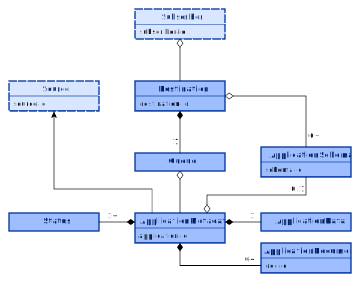

# Resourcen



## Primärresourcen
### [Application Metadata](../models/application/metadata.json)
Die Metadaten des Antrags (Application Metadata) entsprechen dem früheren XFall-Container und tragen allgemeine Informationen zu der Übertragung, wie
- Nachgefragte behördliche Leistung (Public Service Type)
- Antragsteller
- Hinweis auf Fachdaten und das dazugehörige Schema
- Struktur des Antrags (Liste der enthaltenen Dokumente)

### [Destination](../models/destination.json)
Die Destination beschreibt einen technischen Übergabepunkt für Anträge. Dies kann ein Fachverfahren sein, aber auch ein zwischengeschaltetes System wie eine virtuelle Poststelle oder ein Kommunal-Gateway.

Die Destination enthält folgende Informationen:
- Behörde
- technischen Ansprechpartner
- empfangbare Schemata
- technische Benachrichtigungsadresse (siehe [Callback](callback.md))

In Zukunft soll die Destination noch um Schlüssel für eine Ende-zu-Ende-Übertragung erweitert werden.

## Subresourcen
### Application Data
Die Übertragung kann einen Fachdatensatz (Application Data) enthalten. Dieser darf im JSON oder XML Format vorliegen.

### [Application Document](../models/application/document.json)
Einer Übertragung sind Dokumente zugeordnet. Dies sind z.B. Antragsformulare oder Anlagen.

### [Application Schema](../models/application/schema.json)
Die Destination kann Schemata benennen, die empfangen werden können. Eine Übertragung referenziert dann eines dieser Schemata um festzulegen, welche Struktur die Fachdaten haben.

## Datentypen
### [ID-String](../models/common/id-string.json)
Der ID-String ist ein String, der nur die Zeichen A-Z, a-z, 0-9 sowie Bindestrich (-), Unterstrich (_) und Punkt (.) enthält.
- Regex: `^[-_.A-Za-z0-9]+$`

### [MIME-Type](../models/common/mime-type.json)
Der MIME-Type ist ein String, der dem Format der MIME-Typen entspricht.
- Regex: `^[-\w.]+/[-\w.+]+$`

### [Phonenr](../models/common/phonenr.json)
Eine Telefonnummer im internationalen Format, z.B. "+49 89 32168-42". Muss mit einem Plus beginnen und darf danach außer Ziffern nur Leerzeichen ( ) und Bindestriche (-) enthalten.
Regex: `^\+[1-9]([ -]?[0-9]){1,14}$`

### [Status](../models/status.json)
Der Status beschreibt den Fortschritt der Übertragung. Hierzu sind folgende Werte definiert:
- `incomplete`: Die Einlieferung von der Source hat begonnen
- `queued`: Die Übertragung wurde vollständig eingeliefert und akzeptiert
- `sending`: Die Weitergabe wurde begonnen
- `forwarded`: Die Übertragung an die direkt angebundene Destination wurde abgeschlossen
- `delivered`: Die Übertragung hat den vorgesehen Endpunkt erreicht

<!-- theme: info -->
> **Hinweis:** Bei diesem Status handelt es sich um den Übermittlungsstatus vom Sender an den Subscriber. Die Statusmeldungen der Zuständigen Stelle an den Antragsteller sind davon unabhängig.

## Modelle

<!-- theme: warning -->
> ### Hinweis!
>
> Die Modelle werden derzeit überarbeitet.

### Addresse
#### [AddressNational](../models/xfall/address-national.json)

#### [AddressInternational](../models/xfall/address-international.json)

#### [Address](../models/xfall/address.json)
Die Klasse "Address" ist eine Choice (oneOf) zwischen nationaler und internationaler Adresse.

### [Error](../models/error.json)
Die Klasse "Error" dient der Rückmeldung zu einer nicht erfolgreichen Operation.
Sie enthält drei Propertys:
- code: integer - Fehlercode
- msg: string - Fehlermeldung
- ref: string - Referenz auf fehlerhafte Stelle

### [FIM-ID](../models/common/fim-id.json)
Die FIM ID besteht aus einer ID und einer Versionsnummmer.

Beispiel für Stammdatenschema "S99000001V1.0":
```json
{"id":"S99000001","version":"1.0"}
```
- Regex für "id": `^[DFGS]\d{8}$`
- Regex für "version": `^\d+\.\d+$`

### [Identifier](../models/common/identifier.json)

### Person
- [AbstractPerson](../models/xfall/abstract-person.json)
- [Individual](../models/xfall/individual.json)
- [Organization](../models/xfall/organization.json)
- [PublicOrganization](../models/xfall/public-organization.json)

### Public Service Type
- [PublicServiceType](../models/application/public-service-type.json)

